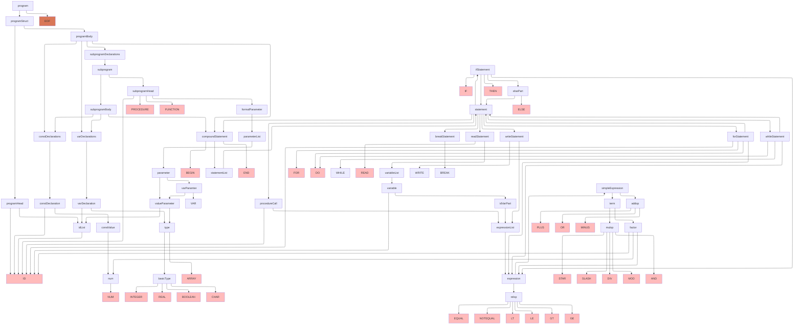

# Pascal2C 技术文档

本文档详细描述Pascal2C编译器的代码结构、功能实现和工作流程。

## 1. 核心文件及功能

### **转换规则说明：**

**Pascal-S** **到** **C** **的主要转换规则**

1. **程序结构:**
   - Pascal-S 的 program 声明映射到 C 的 main 函数及其包含头文件
   - Pascal-S 的程序参数列表转换为 C 的命令行参数
   
2. **数据类型:** 

   - `integer` → `int`
   - `real` → `float`
   - `boolean → int` ($0$ 表示`false`, 非 $0$ 表示`true`)
   - `char` → `char`
   - `array[m..n] of T` → `T array[n-m+1]` 并调整索引方式

3. **控制结构:** 
   - `if-then-else` → `if () {} else {}`
   - `for` 循环 → `for` 循环 (需进行索引处理)
   - `while` 循环 → `while` 循环
   
4. **过程和函数:** 

   - Pascal-S 过程 → C 函数 (返回类型为 `void`)
   - Pascal-S 函数 → C 函数 (带返回类型)
   - `VAR` 参数 → 指针参数

5. **输入输出:** 

   - `read` → `scanf`
    - `write` → `printf`

6. **特殊处理:** 

   - Pascal-S 的作用域规则与 C 不同，需要特别处理嵌套子程序
   - C 不支持嵌套函数定义，需要将嵌套函数提升到全局作用域并传递上下文
   - Pascal-S 的布尔表达式需要转换为 C 的整数表达式

### 1.1 PascalToCTranslator 类 (主要转换器)

**文件**: `include/PascalToCTranslator.h`, `src/PascalToCTranslator.cpp`

**功能**:

- 实现Pascal源代码到C源代码的转换
- 解析Pascal语法树，生成等效的C代码
- 管理符号表和类型转换
- 处理Pascal特有的语言构造

**主要接口**:

```cpp
// 主要公共接口
std::string translate(const std::string &inputFile);  // 转换Pascal文件为C代码
```

**核心方法**:

- `visitProgram`: 处理整个程序结构，添加必要的C头文件和辅助函数
- `visitProgramBody`: 处理程序主体，包括常量声明、变量声明、子程序声明和复合语句
- `visitCompoundStatement`: 处理复合语句(BEGIN...END块)
- `visitIfStatement`/`visitForStatement`/`visitWhileStatement`: 处理条件和循环结构
- `visitReadStatement`/`visitWriteStatement`: 处理Pascal输入/输出语句转换为C对应函数

**工作原理**:

```
      ┌───────────────┐      ┌───────────────┐      ┌───────────────┐
      │ Pascal源代码  │─────>│  ANTLR4解析器  │─────>│   语法树(AST)  │
      └───────────────┘      └───────────────┘      └───────┬───────┘
                                                            │
                                                            ▼
                                                    ┌───────────────┐
                                                    │  访问者模式解析 │
                                                    └───────┬───────┘
                                                            │
                                                            ▼
                                                    ┌───────────────┐
                                                    │    生成C代码   │
                                                    └───────────────┘
```

#### **实现细节**:

+ `PascalToCTranslator::visitProgram(PascalSParser::ProgramContext *context)`

  + 参数：指向语法树树根的指针

  + 具体细节：输出功能所需的标准C包含（`#include <stdio.h>`...）

  + 定义Pascal特定类型和辅助函数(`typedef int boolean`...)
  
+ `visitProgramBody(PascalSParser::ProgramBodyContext *context) `
  
  + 功能：将程序体进行翻译
    + 处理常量声明：**`visitConstDeclarations`** & **`visitConstDeclaration`**
    
      + 首先调用`visitConstDeclarations`，如果没有发现任何常量声明，返回原函数
    
      + 如果有常量声明就调用**`visitConstDeclaration`**，同时获取常量的类型，名称，并加入到符号表的一个元素并且初始化
    
      + 然后根据值的格式判断类型（实数，整数，字符串...，如果都不匹配默认设置为整数类型），并把这个元素加入到符号表中
      + 把获取的常量按照`#define name value` 的形式输出，然后递归处理下一个`const`，直到全部`const`处理完毕
      
    + 处理变量声明：`visitVarDeclarations` & `visitVarDeclaration`
      + 获取变量的列表然后遍历进行处理，然后进行赋予对应的类型，分别给出其在 C 中的类型和在 Pascal 中的类型
      
      + 再次遍历变量的列表，对其进行输出并初始化，其中特别处理了数组类型的翻译和初始化，首先要进行正则匹配
      
        （`"\\[.*\\]"`），其次要根据其数组的维度进行输出和初始化。
      
      + 最后把已经获取的变量写入符号表中，然后递归进行下一行的变量处理，直至所有变量处理完毕
  
+ `visitCompoundStatement`

  + 功能：该函数用于处理 Pascal 中的复合语句（`BEGIN ... END` 块），将其转换为 C 语言中由 `{}` 包裹的代码块。其核心逻辑是递归访问复合语句内部的语句列表（`statementList`），生成对应的 C 代码。
  + 实现原理：触发内部语句的访问
    通过 `visit(context->statementList())`，递归调用 `visitStatementList`，逐层处理复合语句中的所有子语句。

+ `visitIfStatement`

  + 功能：处理`if-then-else`语句
  + 实现原理：
    + **步骤1：表达式访问**
      - **调用链**：
        `visitIfStatement` → `visit(context->expression())` → `visitExpression` → `visitSimpleExpression` → `visitTerm` → `visitFactor`。
      - **作用**：
        递归解析 `IF` 后的条件表达式（如 `x > 5`），生成对应的 C 表达式字符串（如 `(x > 5)`）。
    + **步骤2：类型判断**
      - **调用函数**：`inferExpressionType(cond)`
      - **逻辑**：
        1. **字面量分析**：若表达式是 `true`/`false` 或关系运算（如 `a == b`），直接返回 `BOOLEAN`。
        2. **符号表查找**：若表达式是变量（如 `flag`），查找符号表获取其声明类型。
        3. **递归分析**：对复杂表达式（如 `(a + b) < 10`），分解操作符和操作数，递归推断子表达式类型。
        4. **类型兼容性**：若左操作数为 `INTEGER`，右操作数为 `REAL`，统一为 `REAL`，但最终要求返回 `BOOLEAN`。
    + **步骤3：处理可能的else分支**
      - **调用链**：`visit(context->statement())` → `visitStatement`。
      - **逻辑**：
        - 若分支是简单语句（如 `y := 10;`），直接生成 `y = 10;`。
        - 若分支是复合语句（`BEGIN ... END`），调用 `visitCompoundStatement` 生成 。
  
+ `visitForStatement`
  
    + 功能：处理`for`循环语句
    
  + 实现原理
  
  1. **解析循环变量**：确保变量存在且为整数类型。
  
     - 通过 `context->ID()` 获取循环变量名（如 `i`）。
     - 使用 `TranslatorUtils::toCIdentifier` 确保变量名符合 C 的标识符规则（如避免关键字冲突）。
  
  2. **解析起始和结束表达式**：递归调用表达式解析函数，生成 C 表达式并推断类型。
      - `visitExpression` → `visitSimpleExpression` → `visitTerm` → `visitFactor`。
      - 递归解析表达式，生成 C 表达式字符串（如 `5` 或 `x + 1`）。
      - 使用 `inferExpressionType` 推断起始和结束表达式的类型。
      - 若类型不一致（如 `init` 是 `REAL`，`final` 是 `INTEGER`），生成警告，但允许隐式转换（依赖 C 的自动类型转换）。
  3. **生成 `for` 循环结构**：根据 `TO` 或 `DOWNTO` 生成对应的条件和步进操作。
  4. **类型检查与错误处理**：验证表达式类型兼容性，处理未声明变量或类型不匹配问题。
  5. **处理循环体**：递归访问循环体语句，管理缩进和代码生成。
  
+ `visitWhileStatement`

    + 功能：实现`while`循环
    + 实现原理
      1. **条件表达式解析**：递归解析并生成 C 表达式，结合类型推断确保布尔语义。
      2. **循环体处理**：递归转换循环体内的语句，管理缩进和代码块结构。
      3. **类型检查与错误处理**：验证条件表达式类型，处理未声明变量或类型不兼容问题。
      4. **特殊语法处理**：如字符串比较需转换为 `strcmp`，隐式布尔转换生成警告。


+ `visitReadStatement`

  + 功能：方法负责将 Pascal 的 `read` 语句转换为 C 的 `scanf` 调用
  + 实现原理：

    + **底层调用**：通过 `visit(context->variableList())` 访问 `variableList` 节点，返回一个 `std::vector<std::string>`，包含所有待读取的变量名（如 `["x", "arr[0]"]`）。
    + **变量名处理**：
      - 若变量是数组元素（如 `arr[0]`），提取基变量名 `arr`，并标记 `isArrayAccess = true`。
      - 若变量是函数返回值（如 `func`），自动转换为 `functmp`（根据符号表规则）。
    + **符号表查询**：调用 `symbolTable->hasSymbol(baseVar)` 检查变量是否定义。若未定义，输出警告。
    + **类型提取**：
      - 通过 `symbolTable->getSymbol(baseVar)` 获取变量的 `SymbolEntry`。
      - 若变量是数组且被索引（如 `arr[0]`），使用 `arrayElementType` 确定元素类型（如 `INTEGER`）。
      - 否则，直接使用变量的 `dataType`（如 `REAL`）。
    + 根据变量类型选择格式符：
      - `INTEGER` → `"%d"`
      - `REAL` → `"%f"`
      - `CHAR` → `" %c"`（注意空格防止换行符干扰）
      - `BOOLEAN` → `"%d"`（0/1）
      - **字符串处理**：代码中未显式处理 `STRING` 类型，可能隐含使用 `CHAR` 数组。
    + **引用参数**：
      - 若变量是引用参数（`SymbolEntry.isReference = true`）且非数组，C 中已为指针，无需 `&`。
        例如：`scanf("%d", x)`（`x` 是 `int*`）。
      - 若为普通变量，添加 `&` 获取地址：`scanf("%d", &x)`。
    + **数组处理**：
      - 若变量是数组元素（如 `arr[0]`），直接使用 `&arr[0]`。
      - 若变量是数组名（如 `arr`），无需 `&`（数组名本身是地址）。

+ `visitWriteStatement`

  + 功能：负责将 Pascal 的 `write` 语句转换为 C 的 `printf` 调用，其实现过程如下：
  + 实现原理：
    + **底层调用**：通过 `visit(context->expressionList())` 访问 `expressionList` 节点，返回一个 `std::vector<std::string>`，包含所有待输出的表达式（如 `["x", "str", 10]`）。
    + **表达式顺序**：
      - 由于 ANTLR 解析器的递归特性，表达式列表中的元素按 **从右到左** 的顺序被收集。例如，`write(a, b, c)` 会先处理 `c`，再处理 `b`，最后处理 `a`。
      
      - 代码通过递归调用 `visitExpressionList` 确保最终的参数列表顺序与 Pascal 代码一致。
    + 对每个表达式进行类型分析和格式符匹配：
    
      - **步骤**：
    
        1. **表达式解析**：提取表达式字符串（如 `"x"` 或 `"arr[0]"`）。
        2. **符号表查询**：
           - 若表达式是变量（如 `x`），调用 `symbolTable->hasSymbol(baseVar)` 检查是否定义。未定义时输出警告。
           - 若变量是数组元素（如 `arr[0]`），提取基变量名 `arr`，并通过符号表获取其元素类型（如 `INTEGER`）。
        3. **类型推断**：
           - 调用 `inferExpressionType(expr)` 推断表达式类型。例如：
             - 数值字面量 `10` → `INTEGER`，`3.14` → `REAL`。
             - 字符串字面量 `'abc'` → `STRING`，自动转换为 C 的双引号 `"abc"`。
             - 布尔值 `true` → `BOOLEAN`，映射为 `1`。
        4. **格式符选择**：
           - `INTEGER` → `%d`
           - `REAL` → `%f`
           - `BOOLEAN` → `%d`（转换为 `0` 或 `1`）
           - `CHAR` → `%c`
           - `STRING` → `%s`（需确保字符串以 `\0` 结尾）
    
      - **特殊处理**：
    
        - **字符串字面量**：将 Pascal 的单引号 `'abc'` 转为 C 的双引号 `"abc"`。
    
        - **布尔值**：将 `true`/`false` 转换为 `1`/`0`，避免直接输出字符串。
    
        - **数组元素**：若变量是多维数组（如 `matrix[1][2]`），根据符号表的 `arrayElementType` 确定格式符。
    + **格式字符串**：
      - 初始化 `formatStr` 为 `"\"`，逐步拼接格式符（如 `"%d %s"`）。
      - 例如，输入 `write(x, 'text')` 会生成 `"\"%d %s\""`。
    + **参数列表**：
      - 对每个表达式进行类型适配：
        - 字符串字面量 `'text'` → 转为 `"text"` 并添加到参数列表。
        - 变量 `x` → 直接使用变量名，若为引用参数则解引用（如 `*x`）。
        - 数组元素 `arr[0]` → 直接使用 `arr[0]`（C 数组名即地址）。

+ `visitproducecall`

   1. **提取过程名**
      通过 `context->ID()->getText()` 获取 Pascal 中的过程名，并使用 `TranslatorUtils::toCIdentifier` 转换为 C 兼容的标识符。
   2. **检查参数列表**
      - **带参数的调用**：
        如果存在 `expressionList()`（即参数列表），调用 `visitFunction_Procedure` 生成带参数的 C 函数调用。这一步会处理参数的转换、类型检查以及引用参数的特殊处理。
      - **无参数的调用**：
        如果没有参数，直接生成形如 `id + "()"` 的 C 函数调用。
   3. **符号表校验**
      - 检查符号表中是否存在该过程名，以确定其类型（函数或过程）。
      - 若过程被误用作函数（如忽略返回值），输出警告。
   4. **参数处理**
      - **引用参数（VAR 参数）**：
        若参数通过 `VAR` 传递（按引用），在 C 中需用指针表示。例如，`arg` 会被转换为 `&arg`。
      - **数组参数**：
        - 单维数组直接按值传递（C 中数组名即指针）。
        - 多维数组需调整维度语法，例如 `array[][N]`。
      - **参数顺序**：
        由于 Pascal 参数在嵌套结构中按“从右到左”解析，代码通过反转索引确保参数顺序正确。
   5. **错误与警告**
      - 若过程未在符号表中定义，输出“未定义的函数/过程”警告。
      - 若实参与形参数量不匹配，输出参数数量不匹配警告。

+ `visitfunction_procedure`

   1. **提取函数名和参数列表**

      - 通过 `context->ID()->getText()` 获取函数名，并转换为 C 兼容的标识符。
      - 使用 `visit(context->expressionList())` 获取实际参数列表 `args`。
   2. **符号表校验**

      - 检查符号表中是否存在该函数名。若不存在，输出“未定义的函数/过程”警告。
      - 获取函数的参数列表（形参）以进行类型和数量匹配。
   3. **参数处理**

      - **引用参数（VAR 参数）**：若参数通过 `VAR` 传递（按引用），在 C 中需添加 `&` 符号生成指针。例如，`arg` 转换为 `&arg`。
      - **数组参数**：
        - 单维数组直接按值传递（C 中数组名即指针）。
        - 多维数组需调整语法为 `(*param)[N]` 形式。
      - **参数顺序修正**：
        由于 ANTLR 解析树中参数按嵌套顺序存储（从右到左），需反转索引以确保参数顺序与 Pascal 源代码一致。
   4. **错误与警告**

      - **参数数量不匹配**：若实参与形参数量不一致，输出警告。
      - **类型不兼容**：通过 `inferExpressionType` 推断参数类型，调用 `areTypesCompatible` 检查类型兼容性。
   5. **生成 C 函数调用**
      组合函数名和参数列表，生成符合 C 语法的函数调用字符串。
   6. **多维数组参数**
      - **Pascal 声明**：`array[1..2][1..3] of Integer`
      - **C 转换**：`int (*array)[3]`
        代码通过符号表记录的数组维度信息生成正确的指针语法。

   7. **引用参数（VAR）**
     - **Pascal 调用**：`Proc(VAR x: Integer)`
     - **C 转换**：`Proc(&x)`
       代码检测到 `isReference` 标志后自动添加 `&`。

   8. **参数顺序问题**
     - **Pascal 参数列表**：`(a, b, c)`
     - **ANTLR 解析顺序**：`c, b, a`（嵌套结构）
       代码通过反转索引（`paramIndex = parameters.size() - 1 - i`）确保参数顺序正确。

+ `visitfactor`

   功能：负责将 Pascal 表达式中的**因子**（如变量、常量、函数调用、运算符等）转换为等效的 C 语言代码

   `visitFactor` 处理以下类型的因子：

   1. **数字字面量**（整数、浮点数）

   2. **变量**（简单变量、数组元素）

   3. **带括号的表达式**

   4. **函数调用**

   5. **逻辑非操作**（`NOT`）

   6. **一元减操作**（`-`）

   7. **一元加操作**（`+`）

   8. **字符串/字符字面量**

   9. **布尔值**

      

   其核心逻辑是递归遍历语法树，生成对应的 C 表达式，并进行类型检查和错误处
   
   
      + 处理数字字面量：直接提取数字文本，无需额外处理。
   
   
   
      + 处理带货号的表达式：保留括号以确保运算优先级。
   
   
   
      + 处理字符串/字符字面量：Pascal 字符串用单引号，需转换为 C 的双引号。
   
   
   
   + 处理布尔值：C 无布尔类型，用整数 `1` 和 `0` 模拟。
   
   + 处理函数调用：
   
        - **参数处理**：调用 `visitExpressionList` 获取参数列表。
   
        - **符号表校验**：检查函数是否存在，参数数量和类型是否匹配。
   
        - **引用参数**：若参数是 `VAR` 类型，生成 `&arg`。
   
        - **多维数组参数**：调整语法（如 `int (*arr)[3]`）。
   
   
      + 处理变量（含数组访问）：
   
          - **数组访问**：调用 `visitIdVarPart` 处理索引部分，将 Pascal 的 `arr[i]` 转换为 `arr[i-1]`（假设 Pascal 数组从 1 开始，C 数组从 0 开始）。
   
          - **引用参数（VAR）**：若变量是引用参数，生成解引用形式 `(*var)`。
   
          - **函数返回值**：若变量名与当前函数名相同（如递归函数），转换为临时变量 `funcNametmp`。
   


#### **特殊场景示例**

**1. 多维数组访问**

  - **Pascal 代码**：`matrix[1, 2]`
  - **C 转换**：`matrix[0][1]`
    代码通过 `visitIdVarPart` 处理多维索引，调整偏移。

**2. 引用参数（VAR）**

  - **Pascal 代码**：`Proc(VAR x: Integer)`
  - **C 转换**：`void proc(int *x) { ... }`
    调用时生成 `proc(&x)`。

**3. 函数返回值**

  - **Pascal 代码**：`function F: Integer; begin F := 42; end`
  - **C 转换**：`int F() { int Ftmp = 0; Ftmp = 42; return Ftmp; }`

### 1.2 SymbolTable 类 (符号管理)

**文件**: `include/SymbolTable.h`, `src/SymbolTable.cpp`

**功能**:

- 管理变量、常量和函数的符号表
- 提供符号类型枚举、Pascal基本类型枚举
- 提供存储数组边界信息结构体
- 跟踪管理符号表的符号、作用域和类型信息

- 提供符号、作用域查找和添加功能


**主要接口**:

```cpp
// 符号表的作用域条目
ScopeEntry{
  private:
    std::map<std::string, SymbolEntry> symbols;
    std::string scopeName;
    std::vector<SymbolEntry> parameters;  // 按声明顺序存储参数
  public:
    ScopeEntry(const std::string& name);
    ScopeEntry(const std::string& name, ScopeEntry* parent);
    // 符号管理
    bool addSymbol(const SymbolEntry& symbol);
    bool hasSymbol(const std::string& name) const;
    SymbolEntry& getSymbol(const std::string& name);
    std::string getScopeName() const;
    // 将参数添加到有序列表（用于过程和函数）
    void addParameter(const SymbolEntry& param);
    // 按顺序获取参数
    const std::vector<SymbolEntry>& getParameters() const;
    // 获取参数向量的可变引用以进行修改
    std::vector<SymbolEntry>& getParameters();
    //设置父作用域
    void setParentScope(ScopeEntry *parent);
    // 获取父作用域
    ScopeEntry *getParentScope();
}
// 符号表类，用于管理符号和作用域
SymbolTable{
  private:
    std::vector<std::unique_ptr<ScopeEntry>> scopes;
    int currentScopeIndex;

  public:
    SymbolTable();
    // 作用域管理
    void enterScope(const std::string& scopeName);
    void exitScope();
    bool isInGlobalScope() const;
    ScopeEntry& getCurrentScope();
    const ScopeEntry& getCurrentScope() const;
    bool hasScope(const std::string& scopeName) const;
    const ScopeEntry& getScope(const std::string& scopeName) const;

    // 符号管理
    bool addSymbol(const SymbolEntry& symbol);
    bool hasSymbolInCurrentScope(const std::string& name) const;
    bool hasSymbol(const std::string& name) const;
    SymbolEntry& getSymbol(const std::string& name);
    const SymbolEntry& getSymbol(const std::string& name) const;
    //设置父作用域
	void setCurrentScopeParent(ScopeEntry *parent);
	// 获取父作用域
	ScopeEntry &getParentScope();
}
```

**工作原理**:

- 使用作用域管理嵌套符号条目，共同构成一个类十字链表，并被抽象到`SymbolTable`中
- 每个作用域包含名称和符号映射
- 符号查找从当前作用域向外(直到全局作用域)搜索

**实现细节**:

1. `ScopeEntry` 类存储单一作用域的符号
2. `SymbolTable` 维护 `ScopeEntry` 栈
3. 符号包括变量、常量、函数和过程，以及它们的类型信息
4. 支持引用参数和数组类型

### 1.3 TypeConverter 类 (类型转换)

**文件**: `include/TypeConverter.h`, `src/TypeConverter.cpp`

**功能**:

- 处理Pascal和C类型系统之间的转换
- 维护类型映射和转换规则
- 支持基本类型和数组类型转换

**主要接口**:

```cpp
std::string convertType(PascalType type) const;
std::string convertArrayType(PascalType elementType, const std::vector<ArrayBounds>& dimensions) const;
std::string convertOperator(const std::string& op) const;
std::string convertBooleanValue(const std::string& value) const;
```

**工作原理**:

- 使用类型映射表在Pascal类型和C类型之间转换
- 为数组类型生成特殊处理逻辑
- 转换Pascal特定的运算符和布尔值

**实现细节**:

1. Pascal布尔值 → C 整数 (0/1)
2. Pascal运算符 → C等效运算符 (例如 AND -> &&)
3. Pascal数组 → C带维度的数组

### 1.4 TranslatorUtils 类 (工具函数)

**文件**: `include/TranslatorUtils.h`, `src/TranslatorUtils.cpp`

**功能**:

- 提供通用的转换工具函数
- 处理日志、错误和警告信息
- 字符串和标识符处理
- 将Pascal类型转换为字符串类型

**主要接口**:

```cpp
static void logError(const std::string& message);
static void logWarning(const std::string& message);
static void logInfo(const std::string& message);
static std::string toCIdentifier(const std::string& pascalIdentifier);
static std::string escapeString(const std::string& str);
static bool isValidIdentifier(const std::string& str);
static std::string pascalTypeToString(PascalType type);
```

**工作原理**:

- 提供纯工具函数，无状态
- 实现字符串和标识符转换规则
- 处理程序错误和异常报告

**实现细节**:

1. 将Pascal标识符(不区分大小写)转换为C标识符(区分大小写)
2. 检查C关键字冲突并添加前缀
3. 转义字符串中的特殊字符

### 1.5 ErrorDealer

**文件**:`include/ErrorDealer.h`

**功能**:

+ 提供错误类型

+ 提供错误收集结构体
+ 提供相应错误处理方法

**主要接口**:

```cpp
template<typename T>
void deleteErrorContext(ErrorContext<T>* errorContext);
template<typename T>
void UndefinedFunction(ErrorContext<T> *errorContext);
template<typename T>
static void ArgumentCountMismatch(ErrorContext<T> *errorContext);
template<typename T>
static void MissingArguments(ErrorContext<T> *errorContext);
template<typename T>
static void InvalidArrayIndex(ErrorContext<T> *errorContext);
template<typename T>
static void ArrayIndexOutOfBounds(ErrorContext<T> *errorContext);
template<typename T>
static void UndefinedVariable(ErrorContext<T> *errorContext);
template<typename T>
static void TypeMismatchInAssignment(ErrorContext<T> *errorContext);
template<typename T>
static void NonBooleanCondition(ErrorContext<T> *errorContext);
template<typename T>
static void IgnoredFunctionReturn(ErrorContext<T> *errorContext);
template<typename T>
static void IncompatibleComparison(ErrorContext<T> *errorContext);
template<typename T>
static void ProcedureInAssignment(ErrorContext<T> *errorContext);
```

**工作原理**:

- 提供纯工具函数，无状态
- 实现各种类型的错误处理

**实现细节**:

1. 使用模版函数以适应各种程序位置的错误

2. 定位原Pascal代码的错误具体到行

3. 将错误输出到控制台以及把对应位置错误写入输出文档

### 1.6 Main函数 (程序入口)

**文件**: `src/main.cpp`

**功能**:

- 处理命令行参数
- 调用转换器
- 管理输入/输出文件操作

**工作流程**:

1. 解析命令行参数
2. 读取输入Pascal文件
3. 创建PascalToCTranslator实例
4. 调用translate方法执行转换
5. 将生成的C代码写入输出文件

**实现细节**:

- 支持 `-i` 参数指定输入文件
- 自动根据输入文件名生成输出文件名(.c后缀)
- 提供错误处理和用户反馈

## 2. 数据结构

### 2.1 符号表结构

**SymbolEntry** - 符号条目:

```cpp
struct SymbolEntry {
    std::string name;               // 符号名称
    SymbolType symbolType;          // 符号类型(变量/常量/函数/过程)
    PascalType dataType;            // 数据类型
    std::string value;              // 常量值
    bool isReference = false;       // 是否为引用参数
    PascalType arrayElementType;    // 数组元素类型
    std::vector<ArrayBounds> arrayDimensions; // 数组维度信息
};
```

**ScopeEntry** - 作用域条目:

```cpp
class ScopeEntry {
private:
    std::map<std::string, SymbolEntry> symbols;  // 符号表映射
    std::string scopeName;                       // 作用域名称
    std::vector<SymbolEntry> parameters;  		 // 判断是否为引用调用参数
    ScopeEntry *parentScope;					 // 存储父作用域
};
```

**ArrayBounds** - 数组边界:

```cpp
struct ArrayBounds {
    int lowerBound;  // 下界
    int upperBound;  // 上界
};
```

**SymbolTable** - 管理符号和作用域:

```cpp
class SymbolTable {
private:
    std::vector<std::unique_ptr<ScopeEntry>> scopes;	// 管理所有符号和作用域
    int currentScopeIndex;								// 当前作用域索引
};
```


### 2.2. 类型系统

**PascalType** - Pascal类型枚举:

```cpp
enum class PascalType {
    INTEGER,
    REAL,
    BOOLEAN,
    CHAR,
    ARRAY,
    STRING
    // 其他类型...
};
```

**SymbolType** - 符号类型枚举:

```cpp
enum class SymbolType {
    VARIABLE,
    CONSTANT,
    FUNCTION,
    PROCEDURE,
    PARAMETER
};
```

## 3. 转换流程

### 3.1 整体转换流程

1. **初始化阶段**:
   - 创建转换器实例
   - 初始化符号表和类型转换器
   - 重置内部状态(缩进、作用域标志等)

2. **解析阶段**: （词法分析、语法分析）
   - 使用ANTLR4设置输入流
   - 创建词法分析器和解析器
   - 执行语法解析生成抽象语法树(AST)

3. **转换阶段**:（语义分析、代码生成、错误处理与恢复）
   - 访问AST的程序节点开始转换
   - 生成标准C包含文件和辅助定义
   - 访问并转换每个程序部分:
     - 常量声明
     - 变量声明
     - 子程序声明
     - 主体语句
   - 管理作用域进入和退出
   - 为每种Pascal构造生成对应C代码

4. **完成阶段**:
   - 返回生成的C代码
   - 输出到文件

### 3.2 详细调用流程

程序启动调用流程:



### 3.3 关键翻译示例

1. **Pascal `if` 语句转换为C `if` 语句**:

   ```pascal
   if condition then
     statement1
   else
     statement2
   ```

   转换为:

   ```c
   if (condition) {
     statement1;
   } else {
     statement2;
   }
   ```

2. **Pascal `for` 循环转换为C `for` 循环**:

   ```pascal
   for i := 1 to 10 do
     statement
   ```

   转换为:

   ```c
   for (i = 1; i <= 10; ++i) {
     statement;
   }
   ```

3. **Pascal`while`循环转换为C`while`循环**:

   ```cpp
   while i < 5 do
   begin
     statement;
   end;
   ```

   转换为:

   ```cpp
   while(i < 5) {
     statement;
   }
   ```

4. **Pascal过程调用转换为C函数调用**:

   ```pascal
   procedure test(var x: integer; y: real);
   ```

   转换为:

   ```c
   void test(int* x, float y);
   ```

5. **Pascal数组声明转换为C数组**:

   ```pascal
   var arr: array[1..10] of integer;
   ```

   转换为:

   ```c
   int arr[10];
   ```

6. **Pascal输入/输出转换为C函数**:

   ```pascal
   write('Value: ', x);
   ```

   转换为:

   ```c
   printf("Value: %d", x);
   ```

## 4. 词法分析

#### 翻译表

Pascal2C项目使用ANTLR4框架生成的词法分析器，其词法规则定义在PascalS.g4文件中。词法分析过程产生以下翻译表：

1. **关键字映射：**

​	Pascal关键字（如`PROGRAM`, `CONST`, `VAR`, `PROCEDURE`等）通过片段规则（`fragment rules`）进行大小写不敏感匹配

​	通过`P R O G R A M`这样的方式定义，利用`fragment`片段规则实现大小写不敏感

2. **运算符和符号映射：**

​	分隔符：`;`, `:`, `.`, `,`等直接映射

​	比较运算符：`=` → `EQUAL`, `<>` → `NOTEQUAL`, `<` → `LT`等

​	算术运算符：`+` → `PLUS`, `-` → `MINUS`, `*` → `STAR`, `/` → `SLASH`

​	赋值运算符：`:=` → `ASSIGNOP`

​	其他特殊运算符：`..` → `DOTDOT`

3. 标识符和常量：

​	标识符（ID）：`[a-zA-Z_][a-zA-Z0-9_]*`

​	数值（NUM）：`[0-9]+ ('.' [0-9]+)?`

​	字符串（STRING）：`\' (~['\r\n] | \'\')* \'`

​	布尔值（LETTER）：`TRUE | FALSE`

#### 注释的处理

注释处理通过ANTLR特殊的`skip`通道（channel）实现：

1. **块注释:**

   `COMMENT : '{' .*? '}' -> skip ;`

​	使用贪婪匹配`.*?`捕获花括号内的所有内容

​	`-> skip`指令告诉ANTLR丢弃这些标记，不传递给语法分析器

2. **行注释：**

​	`LINE_COMMENT : '//' .*? '\n' -> skip;`

​	处理以双斜杠开头的行注释

​	同样使用`-> skip`指令忽略这些标记

3. **空白处理：**

​	`WS : [ \t\r\n]+ -> skip ;`

​	空白字符（空格、制表符、回车、换行）也被忽略

#### 与语法分析器的接口

词法分析器与语法分析器的接口通过ANTLR框架自动建立：

1. **标记流传递：**

   在translate方法中创建词法分析器，并将其输出提供给语法分析器：

   ```cpp
   antlr4::ANTLRInputStream input(stream);
   PascalSLexer lexer(&*input*);
   antlr4::CommonTokenStream tokens(&*lexer*);
   PascalSParser parser(&*tokens*);
   ```

2. **词法符号交互：**

   词法分析器(`PascalSLexer`)将输入文本转换为标记流(tokens)

   这些标记通过`CommonTokenStream`传递给语法分析器

   语法分析器(`PascalSParser`)利用这些标记来构建抽象语法树(AST)

## 5. 语法分析

#### 实现方法

Pascal2C项目的语法分析采用自顶向下的方法，具体基于ANTLR4自动生成的递归下降解析器：

1. **语法规则定义：**

   在`PascalS.g4`文件中定义完整的Pascal-S语法规则

   从顶层规则`program`开始，逐步细化到各个语法结构

2. **解析过程：**

   在`translate`方法中创建解析器并解析源代码：

   ```cpp
   PascalSParser parser(&tokens);
   PascalSParser::ProgramContext *tree = parser.program();
   ```

​	解析器根据语法规则构建抽象语法树(AST)

3. **访问者模式：**

   `PascalToCTranslator`类实现了`PascalSVisitor`接口

   为每个语法规则提供相应的visit方法，负责生成对应的C代码

   通过`visitProgram`方法开始递归访问整个语法树

4. **符号表辅助：**

   使用`SymbolTable`类管理变量、常量和函数的作用域

   在语法分析过程中维护符号表，用于类型检查和代码生成

## 6. 语义分析

+ 实现方法：使用ANTLR的访问者模式访问抽象语法树（AST），通过遍历树进行语法的转换。
+ 支持类型：Pascal中的`INTEGER`、`REAL`、`BOOLEAN`、`CHAR`、`ARRAY`、`CONST`
+ 类型检查：实现了对：
  + 变量声明与使用是否匹配
  + 赋值语句左右类型是否匹配
  + 函数返回类型检查
  + 类型转换是否合法（部分隐式类型转换）
+ 表达式：
  + 表达式的最终结果的类型判断
+ 数组：
  + 数组索引类型检查
  + 数组维数检查（多维数组）
  + 数组元素类型一致性检查（借助于赋值语句类型兼容性实现）
+ 参数：
  + 参数传递方式：传值调用、传址调用
  + 参数类型检查
  + 部分隐式类型转换
  + 函数/过程调用时实参与形参的数量匹配
+ 函数/过程调用：
  + 函数原型声明
  + 返回值是否正确使用
+ 语句：
  + 支持语句：`if`，`else`，`break`，`for`，`while`
  + 变量作用域检查
  + 赋值语句类型兼容性
  + 条件语句条件表达式须是布尔类型
+ 运算：
  + 支持运算：$\div$ $mod$  $+$ $-$ $\times$ ~ $|$ $\&$   

>新增文法处理（相较于基础文法要求）：
>
>+ `while`语句的支持
>+ `break`语句的支持 

## 7. 符号表管理

符号表管理在转换过程中的作用:

1. **作用域管理**:
   - 进入新作用域: `symbolTable->enterScope(name)`
   - 退出当前作用域: `symbolTable->exitScope()`
   - 作用域层次结构追踪嵌套的子程序和程序块

2. **符号解析**:
   - 添加新符号: `symbolTable->addSymbol(entry)`
   - 查找符号: `symbolTable->hasSymbol(name)`
   - 获取符号信息: `symbolTable->getSymbol(name)`

3. **类型检查**:
   - 获取变量类型以生成正确的C代码
   - 确定函数返回类型
   - 检查数组访问的有效性

示例调用链:

```
visitVarDeclaration
  ├── 获取标识符列表: visitIdList
  ├── 获取类型信息: visitType
  ├── 为每个标识符生成C声明
  └── 将每个变量添加到符号表: symbolTable->addSymbol(entry)
```

## 8. 异常处理

#### **语法分析检错:**

该语法分析器能够检测以下类型的语法错误：

1. **输入中的标记与语法规则期望的标记类型不匹配**

   ```pascal
   // 缺少program声明
   var x: integer;
   begin
     x := 10;
   end.
   ```

   错误输出:

   ```shell
   line 2:0 mismatched input 'var' expecting PROGRAM
   ```

2. **语法分析器期望某个标记但在输入中找不到**

   ```pascal
   program Test;
   var x: integer;
   begin
     if x > 10  // 缺少then
       x := 20;
   end.
   ```

   错误输出：

   ```shell
   line 5:4 missing THEN at 'x'
   ```

3. **表达式错误检测**

   $eg.$ 操作符使用不当

   ```pascal
   program Test;
   var x: integer;
   begin
     x := * 10; // 赋值操作符后直接跟乘法操作符无效
   end.
   ```

   错误输出：

   ```shell
   line 4:7 no viable alternative at input 'x:=*'
   ```

4. **输入中有不应该出现的多余标记**

   ```pascal
   program Test;
   var x: integer;; // 多余的分号
   begin
     x := 10; 
     write(x);
   end.
   ```

   错误输出：

   ```shell
   line 2:15 extraneous input ';' expecting BEGIN
   ```

#### **异常处理策略:**

1. **TranslatorException 类**:
   - 包含错误消息的自定义异常
   - 用于报告部分语义错误

2. **错误报告**:
   - `TranslatorUtils::logError`: 报告严重错误
   - `TranslatorUtils::logWarning`: 报告警告但继续处理
   - `TranslatorUtils::logInfo`: 报告信息性消息

3. **异常捕获点**:
   - `translate()` 方法捕获所有异常
   - `main()` 函数捕获所有未处理异常

#### **语义错误在转换成C语言后的错误处理：**

+ **`ErrorDealer`类**：
+ 如果存在未声明的变量使用，则进行报错，并将错误输出到对应C语言的对应行中，并继续尝试转换
  
+ 如果存在左右类型不同的情况，则进行报错，并将错误输出到对应C语言的对应行中，并继续尝试转换
  
+ 如果存在函数最后返回值与函数类型不符的情况，则进行报错，并将错误输出到对应C语言的对应行中，并继续尝试转换
  
+ 如果存在未定义的函数/过程，则进行报错，并将错误输出到对应C语言的对应行中，并继续尝试转换
  
+ 如果函数调用时，实参数量多余与形参数量，则进行报错，并将错误输出到对应C语言的对应行中，并继续尝试转换
  
+ 如果函数调用时，函数参数有漏缺，则进行报错，并将错误输出到对应C语言的对应行中，并继续尝试转换
  
+ 如果原Pascal数组索引定义不合法，则进行报错，并将错误输出到对应C语言的对应行中，并继续尝试转换
  
+ 如果数组索引使用不合法，则进行报错，并将错误输出到对应C语言的对应行中，并继续尝试转换
  
+ 如果条件语句中使用了非布尔类型的条件，则进行报错，并将错误输出到对应C语言的对应行中，并继续尝试转换
  
+ 如果忽略了函数的返回值，则进行报错，并将错误输出到对应C语言的对应行中，并继续尝试转换
  
+ 如果比较操作类型不兼容，则进行报错，并将错误输出到对应C语言的对应行中，并继续尝试转换
  
+ 如果错误地将过程加入赋值操作，则进行报错，并将错误输出到对应C语言的对应行中，并继续尝试转换

## 9. 局限性和扩展点

当前实现的局限性:

1. 不支持复杂的Pascal类型(记录、集合、枚举)
2. 有限的标准函数库支持
3. 可能不完全处理所有Pascal语言特性

潜在扩展点:

1. 添加更多Pascal类型支持
2. 增强错误检测和报告功能
4. 支持更多的Pascal语言构造
5. 增加优化选项（优化遍历AST树的逻辑、优化访问`expression`的效率、优化g4文法，减少无效状态）

## 10. 总结

Pascal2C是一个使用访问者模式进行源码转换的编译器，使用ANTLR4进行语法分析。主要组件包括:

1. **PascalToCTranslator**: 核心转换引擎，实现主要转换逻辑
2. **SymbolTable**: 管理符号和作用域
3. **TypeConverter**: 处理类型系统转换
4. **TranslatorUtils**: 提供辅助工具函数
5. **ErrorDealer**: 提供转换后错误处理函数

程序处理流程为:

1. 解析命令行参数
2. 读取Pascal源文件 
3. 生成抽象语法树
4. 遍历语法树生成C代码
5. 输出转换后的C代码到文件

该项目展示了一个完整的源码转换实现，利用符号表和类型系统实现两种语言之间的映射，并通过访问者模式处理复杂的语法结构。 